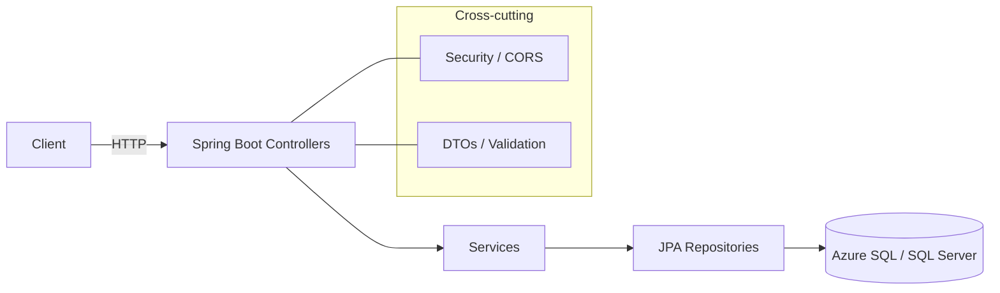

# 🏥 Campus Clinic API - Medical Management System

<div align="center">


[](https://github.com/adryanmasson/campus-clinic-API/actions/workflows/ci.yml)

**Enterprise-grade medical clinic management system with RESTful API, intelligent appointment scheduling, comprehensive electronic medical records, and automated audit trails.**

[🌐 Production](https://clinic-api-app.azurewebsites.net/api/specialties) | [🧪 Dev Environment](https://clinic-api-dev-app.azurewebsites.net/api/specialties) | [📖 Documentation](#-api-endpoints)

> 💡 **Multi-Environment Setup:** Production (free F1 plan) + Dev (B1 plan, Brazil South) with separate branches and automated CI/CD pipelines.

</div>

---

## 📋 About the Project

Complete management system for medical clinics, developed with **Spring Boot** and **SQL Server**, providing full control over:

- 👨‍⚕️ **Doctors and Medical Specialties Management**
- 👤 **Patient Registration and Medical History**
- 📅 **Appointment Scheduling and Management**
- 📝 **Electronic Medical Records with Automatic Audit Trail**
- 🔍 **Advanced Queries and Reports**

### 🎯 Technical Highlights

- ✅ **RESTful Architecture** with standardized response patterns (ApiResponse wrapper)
- ✅ **Dual Database Support** - Azure SQL Server (production) + H2 in-memory (local dev/testing)
- ✅ **Complete English Codebase** - All code, comments, and documentation in English
- ✅ **Centralized Exception Handling** with semantic exceptions (Conflict, BusinessRule, DuplicateResource)
- ✅ **Native SQL Server Features** - Stored procedures, functions, triggers, and computed columns
- ✅ **Audit Trail System** - Automatic tracking of medical record changes via database triggers
- ✅ **CI/CD Pipelines** - Automated build, test, and deployment via GitHub Actions
- ✅ **Multi-Environment** - Separate prod/dev environments with branch-specific deployments
- ✅ **Production-Ready** - HikariCP tuning, connection pooling, Always On (dev), Spring Security
- ✅ **Business Validations** at multiple layers (Database constraints + Application logic)

### 🌟 Reviewer Highlights
- **Fast to run**: one-command run via Docker.
- **Production-minded**: CI builds and tests on every push (GitHub Actions).
- **Pragmatic design**: clean layering (controllers → services → repositories) and DTOs.
- **Database-first**: stored procedures, functions, and triggers with audit.

---

## 🛠️ Technology Stack

### Backend
- **Java 17** - LTS with modern features
- **Spring Boot 3.4.5** - Main framework
- **Spring Data JPA + Hibernate** - ORM and persistence
- **Spring Security** - Authentication and CORS configuration
- **HikariCP** - High-performance connection pooling
- **Maven** - Build and dependency management

### Database
- **Azure SQL Database** - Production database (cloud-hosted)
- **H2 Database** - Local development and testing (in-memory, SQL Server mode)
- **T-SQL** - Custom procedures, functions, triggers, and computed columns

### DevOps & Cloud
- **Azure App Service (Windows)** - Application hosting (prod F1, dev B1)
- **GitHub Actions** - Automated CI/CD with separate prod/dev workflows
- **Azure CLI** - Infrastructure provisioning and management
- **Microsoft JDK 17** - Runtime on Azure App Service

---

## 🏗️ Architecture

```
┌─────────────────┐
│   Frontend      │
│  (Angular/React)│
└────────┬────────┘
         │ HTTPS
         ▼
┌─────────────────────────────────────────┐
│         Spring Boot REST API            │
├─────────────────────────────────────────┤
│  ┌──────────────┐  ┌─────────────────┐ │
│  │ Controllers  │  │  Security       │ │
│  │  (REST)      │  │  (CORS/Auth)    │ │
│  └──────┬───────┘  └─────────────────┘ │
│         │                                │
│  ┌──────▼───────────────────────────┐  │
│  │       Services Layer             │  │
│  │  (Business Logic & Validation)   │  │
│  └──────┬───────────────────────────┘  │
│         │                                │
│  ┌──────▼───────────────────────────┐  │
│  │    Repositories (JPA/Hibernate)  │  │
│  └──────┬───────────────────────────┘  │
└─────────┼───────────────────────────────┘
          │ JDBC
          ▼
┌─────────────────────────────────────────┐
│      SQL Server Database (Azure)        │
├─────────────────────────────────────────┤
│  • Tables: specialties, doctors,        │
│    patients, appointments,              │
│    medical_records, medical_record_audit│
│  • Functions: calculate_age             │
│  • Procedures: create_appointment       │
│  • Triggers: trg_medical_record_audit   │
└─────────────────────────────────────────┘
```

---

## 📚 API Endpoints

### Base URL
```
https://clinic-api-app.azurewebsites.net
```

All endpoints are prefixed with `/api` automatically via `spring.mvc.servlet.path=/api` configured in application.properties.

### 🩺 Medical Specialties

#### List All Specialties
```http
GET /api/specialties
```

**Response (200 OK)**
```json
{
  "status": "success",
  "message": "Specialties listed successfully.",
  "data": [
    {
      "specialtyId": 1,
      "name": "General Medicine",
      "description": "Treatment of common diseases and general health"
    }
  ]
}
```

#### Get Specialty by ID
```http
GET /api/specialties/{id}
```

#### Create New Specialty
```http
POST /api/specialties
Content-Type: application/json

{
  "name": "Cardiology",
  "description": "Treatment of heart and cardiovascular system"
}
```

#### Update Specialty
```http
PUT /api/specialties/{id}
Content-Type: application/json

{
  "name": "Clinical Cardiology",
  "description": "Updated description"
}
```

#### Delete Specialty
```http
DELETE /api/specialties/{id}
```

---

### 👨‍⚕️ Doctors

#### List All Doctors
```http
GET /api/doctors
```

**Response (200 OK)**
```json
{
  "status": "success",
  "message": "Doctors listed successfully.",
  "data": [
    {
      "doctorId": 1,
      "name": "Dr. James Anderson",
      "medicalLicense": "CRM123456",
      "specialty": {
        "specialtyId": 1,
        "name": "General Medicine"
      },
      "birthDate": "1975-04-20",
      "phone": "11912345678",
      "active": true
    }
  ]
}
```

#### Get Doctor by ID
```http
GET /api/doctors/{id}
```

#### Get Doctors by Specialty
```http
GET /api/doctors/specialty/{specialty_id}
```

#### Register New Doctor
```http
POST /api/doctors
Content-Type: application/json

{
  "name": "Dr. James Anderson",
  "medicalLicense": "CRM123456",
  "specialty": {
    "specialtyId": 1
  },
  "birthDate": "1975-04-20",
  "phone": "11912345678"
}
```

#### Update Doctor
```http
PUT /api/doctors/{id}
Content-Type: application/json

{
  "name": "Dr. James Anderson Jr.",
  "phone": "11999999999"
}
```

#### Get Doctor Available Time Slots
```http
GET /api/doctors/{id}/available-slots?date={yyyy-MM-dd}
```

**Response**: Available time slots for appointments on specified date

#### Get Doctor's Upcoming Appointments
```http
GET /api/doctors/{id}/upcoming/appointments
```

#### Get Doctor's Appointment Report
```http
GET /api/doctors/{id}/report/appointments
```

---

### 👤 Patients

#### List All Patients
```http
GET /api/patients
```

**Response (200 OK)**
```json
{
  "status": "success",
  "message": "Patients listed successfully.",
  "data": [
    {
      "patientId": 1,
      "name": "John Smith",
      "gender": "M",
      "cpf": "12345678901",
      "birthDate": "1990-05-15",
      "phone": "11987654321",
      "address": "123 Main St",
      "email": "john.smith@email.com"
    }
  ]
}
```

#### Get Patient by ID
```http
GET /api/patients/{id}
```

#### Get Patient Age
```http
GET /api/patients/{id}/age
```

**Response**: Calculates patient's age using the `calculate_age` database function

#### Get Patient's Appointment Report
```http
GET /api/patients/{id}/report/appointments/{months}
```

**Response**: Appointment report for the last N months

#### Register New Patient
```http
POST /api/patients
Content-Type: application/json

{
  "name": "John Smith",
  "gender": "M",
  "cpf": "12345678901",
  "birthDate": "1990-05-15",
  "phone": "11987654321",
  "address": "123 Main St",
  "email": "john.smith@email.com"
}
```

#### Update Patient
```http
PUT /api/patients/{id}
Content-Type: application/json

{
  "phone": "11999999999",
  "email": "new.email@email.com"
}
```

#### Get Patient History
```http
GET /api/patients/{id}/history
```

**Response**: Complete medical history with appointments and records

---

### 📅 Appointments

#### List All Appointments
```http
GET /api/appointments
```

**Response (200 OK)**
```json
{
  "status": "success",
  "message": "Appointments listed successfully.",
  "data": [
    {
      "id": 1,
      "patientName": "John Smith",
      "doctorName": "Dr. James Anderson",
      "appointmentDate": "2025-01-15",
      "startTime": "09:00:00",
      "endTime": "09:30:00",
      "status": "SCHEDULED"
    }
  ]
}
```

#### Get Appointment by ID
```http
GET /api/appointments/{id}
```

#### Get Appointments by Patient
```http
GET /api/appointments/patient/{patient_id}
```

#### Get Appointments by Doctor
```http
GET /api/appointments/doctor/{doctor_id}
```

#### Get Appointments by Date
```http
GET /api/appointments/date/{yyyy-MM-dd}
```

#### Schedule New Appointment
```http
POST /api/appointments/schedule
Content-Type: application/json

{
  "patientId": 1,
  "doctorId": 1,
  "appointmentDate": "2025-01-15",
  "startTime": "09:00:00",
  "endTime": "09:30:00"
}
```

#### Update Appointment Status
```http
PUT /api/appointments/{id}
Content-Type: application/json

{
  "status": "COMPLETED"
}
```

#### Cancel Appointment
```http
PUT /api/appointments/{id}/cancel
```

> **Note**: Cancellation changes status to CANCELLED and preserves record for audit

---

### 📝 Medical Records

#### List All Medical Records
```http
GET /api/medical-records
```

**Response (200 OK)**
```json
{
  "status": "success",
  "message": "Medical records returned successfully.",
  "data": [
    {
      "recordId": 1,
      "appointmentId": 1,
      "patientName": "John Smith",
      "doctorName": "Dr. James Anderson",
      "anamnesis": "Patient reports headache and fever for 2 days",
      "diagnosis": "Viral infection - Common cold",
      "prescription": "Rest, hydration, Paracetamol 500mg every 6 hours",
      "recordDate": "2024-12-10"
    }
  ]
}
```

#### Get Medical Record by ID
```http
GET /api/medical-records/{id}
```

#### Get Medical Record by Appointment
```http
GET /api/medical-records/appointment/{appointment_id}
```

#### Create New Medical Record
```http
POST /api/medical-records
Content-Type: application/json

{
  "appointmentId": 1,
  "anamnesis": "Patient reports...",
  "diagnosis": "Diagnostic hypothesis...",
  "prescription": "Prescribed medication..."
}
```

#### Update Medical Record
```http
PUT /api/medical-records/{id}
Content-Type: application/json

{
  "anamnesis": "Updated patient history",
  "diagnosis": "Updated diagnosis",
  "prescription": "New prescription"
}
```

#### Delete Medical Record
```http
DELETE /api/medical-records/{id}
```

> **⚠️ Important**: All changes to medical records are automatically logged in the audit table through a database trigger.

---

## � Exception Handling & Validation

The API uses centralized exception handling with semantic, domain-specific exceptions:

### Custom Exceptions

#### DuplicateResourceException (409 Conflict)
Thrown when attempting to create a resource that already exists:
- Medical license already registered for another doctor
- Patient CPF already in database
- Medical record already exists for an appointment

#### AppointmentConflictException (409 Conflict)
Thrown when scheduling/updating appointments with conflicts:
- Doctor has overlapping appointment at the scheduled time
- Database integrity violation during appointment creation

#### BusinessRuleException (400 Bad Request)
Thrown when business validations fail:
- Patient has associated appointments (cannot delete)
- Appointment already cancelled (cannot cancel again)
- Invalid status values for appointments
- Null/required fields missing

#### EntityNotFoundException (404 Not Found)
Thrown when a requested resource is not found (JPA standard):
- Patient not found
- Doctor not found
- Appointment not found
- Specialty not found
- Medical record not found

### Response Format

All error responses follow the standard `ApiResponse` format:

```json
{
  "status": "error",
  "message": "Resource not found",
  "data": null
}
```

### HTTP Status Codes

| Status | Meaning | Common Causes |
|--------|---------|---------------|
| 200 OK | Success | Normal CRUD operations |
| 201 Created | Resource created | POST successful |
| 400 Bad Request | Validation error | Invalid input, business rule violation |
| 404 Not Found | Resource missing | ID not found in database |
| 409 Conflict | Duplicate or conflict | Duplicate resource, schedule conflict |
| 500 Internal Server Error | Unexpected error | Unhandled exception |

---

## �🗄️ Data Model

### Main Tables

- **`specialties`** - Medical specialties (General Medicine, Cardiology, etc.)
- **`doctors`** - Doctor registry with medical license and specialty
- **`patients`** - Patient registry with personal and contact information
- **`appointments`** - Medical appointment bookings
- **`medical_records`** - Electronic medical records linked to appointments
- **`medical_record_audit`** - Medical record change history

### Functions and Procedures

#### Function: `dbo.calculate_age`
Calculates a person's age based on their date of birth.

```sql
SELECT dbo.calculate_age('1990-05-15') AS age
-- Returns: 35
```

#### Stored Procedure: `dbo.create_appointment`
Creates a new appointment with integrated business validations.

```sql
EXEC create_appointment 
  @p_patient_id = 1,
  @p_doctor_id = 1,
  @p_appointment_date = '2025-01-15',
  @p_start_time = '10:00',
  @p_end_time = '10:30'
```

#### Trigger: `trg_medical_record_audit_update`
Automatically logs all changes to medical records in the audit table.

---

## 🚀 Quick Start

### Prerequisites
- Java 17 or higher
- Maven 3.6+
- Azure SQL Database (or SQL Server 2019+)
- Azure CLI (for deployment)

### 🏃 Running Locally

1. **Clone the repository**
```bash
git clone https://github.com/adryanmasson/campus-clinic-API.git
cd campus-clinic-API
```

2. **Run with H2 (in-memory database)**
```bash
mvn spring-boot:run
```
The API will start at `http://localhost:8080/api`

3. **Run with Azure SQL Server**
```bash
# Set environment variables
export SPRING_DATASOURCE_URL="jdbc:sqlserver://your-server.database.windows.net:1433;database=clinic_db;encrypt=true"
export SPRING_DATASOURCE_USERNAME="your-username"
export SPRING_DATASOURCE_PASSWORD="your-password"
export SPRING_JPA_DDL_AUTO="update"

mvn spring-boot:run
```

4. **Run with Docker (optional)**
```bash
# Build image
docker build -t campus-clinic-api .

# Run container
docker run -p 8080:8080 \
  -e SPRING_DATASOURCE_URL="jdbc:sqlserver://..." \
  -e SPRING_DATASOURCE_USERNAME="..." \
  -e SPRING_DATASOURCE_PASSWORD="..." \
  campus-clinic-api
```

### 🧪 Testing the API

Once running, test with curl or Postman:
```bash
# List specialties
curl http://localhost:8080/api/specialties

# Get specific patient
curl http://localhost:8080/api/patients/1

# Create appointment
curl -X POST http://localhost:8080/api/appointments \
  -H "Content-Type: application/json" \
  -d '{"patientId":1,"doctorId":1,"appointmentDate":"2025-01-15","startTime":"09:00","endTime":"10:00"}'
```

---

## 🗄️ Database Setup

### H2 (Local Development - Default)
No setup required! The application automatically:
- Creates an in-memory H2 database in SQL Server compatibility mode
- Registers SQL Server-specific function aliases (`calculate_age`, `create_appointment`)
- Runs JPA schema generation on startup

### Azure SQL Server (Production)

1. **Create Azure SQL Database**
```bash
az sql server create --resource-group clinic-api-resources \
  --name clinic-db-server --location brazilsouth \
  --admin-user adminuser --admin-password 'YourPassword123!'

az sql db create --resource-group clinic-api-resources \
  --server clinic-db-server --name clinic_db \
  --service-objective Basic
```

2. **Run schema script** (first time only)
```bash
sqlcmd -S clinic-db-server.database.windows.net \
  -d clinic_db -U adminuser -P 'YourPassword123!' \
  -i campus_clinic_schema.sql
```

3. **Seed sample data** (optional)
```bash
sqlcmd -S clinic-db-server.database.windows.net \
  -d clinic_db -U adminuser -P 'YourPassword123!' \
  -I -i src/main/resources/db/sample_data_english.sql
```

---

## ☁️ Azure Deployment

### Environment Setup

This project uses **two environments**:
- **Production** (`main` branch) → `clinic-api-app` (F1 free tier)
- **Development** (`dev` branch) → `clinic-api-dev-app` (B1 plan, Always On enabled)

### Automated Deployment (GitHub Actions)

Deployments trigger automatically on push to `main` or `dev` branches:

1. **Production Pipeline** (`.github/workflows/clinic-api-deploy.yml`)
   - Triggers on push to `main`
   - Builds with Maven
   - Deploys to `clinic-api-app`

2. **Dev Pipeline** (`.github/workflows/clinic-api-deploy-dev.yml`)
   - Triggers on push to `dev`
   - Builds with Maven
   - Deploys to `clinic-api-dev-app`

### Required GitHub Secrets

Set these in your repository settings (`Settings` → `Secrets and variables` → `Actions`):

```
AZURE_CREDENTIALS: {
  "clientId": "<service-principal-client-id>",
  "clientSecret": "<service-principal-secret>",
  "subscriptionId": "<subscription-id>",
  "tenantId": "<tenant-id>"
}
```

### Azure App Service Configuration

Both environments require these **Application Settings**:

```bash
# Database connection
SPRING_DATASOURCE_URL=jdbc:sqlserver://clinic-db-server.database.windows.net:1433;database=clinic_db;encrypt=true;trustServerCertificate=false;hostNameInCertificate=*.database.windows.net;loginTimeout=30
SPRING_DATASOURCE_USERNAME=your-username
SPRING_DATASOURCE_PASSWORD=your-password
SPRING_DATASOURCE_DRIVER=com.microsoft.sqlserver.jdbc.SQLServerDriver

# JPA configuration
SPRING_JPA_DDL_AUTO=update
SPRING_JPA_DATABASE_PLATFORM=org.hibernate.dialect.SQLServerDialect

# Deployment settings
SPRING_SQL_INIT_MODE=never
JAVA_OPTS=-Dserver.port=%HTTP_PLATFORM_PORT%
```

### Manual Deployment

```bash
# Login to Azure
az login

# Deploy to production
az webapp deploy --resource-group clinic-api-resources \
  --name clinic-api-app \
  --src-path target/campus-clinic-api-0.0.1-SNAPSHOT.jar \
  --type jar

# Deploy to dev
az webapp deploy --resource-group clinic-api-resources \
  --name clinic-api-dev-app \
  --src-path target/campus-clinic-api-0.0.1-SNAPSHOT.jar \
  --type jar
```

---

### Prerequisites

- ☕ **Java 17** or higher
- 📦 **Maven 3.8+**
- 🗄️ **SQL Server 2019+** (or LocalDB/Docker)
- 🔧 **IDE** (IntelliJ IDEA, Eclipse, VS Code)

### Steps

1. **Clone the repository**
```bash
git clone https://github.com/adryanmasson/campus-clinic-api.git
cd campus-clinic-api
```

2. **Configure the database**

Create a SQL Server database:
```sql
CREATE DATABASE campus_clinic;
```

Execute the schema script:
```bash
sqlcmd -S localhost -d campus_clinic -i campus_clinic_schema.sql
```

(Optional) Populate with sample data:
```bash
sqlcmd -S localhost -d campus_clinic -i sample_data_english.sql
```

3. **Configure environment variables**

The application uses environment variables for database configuration. Set them in your system:

**Windows (PowerShell):**
```powershell
$env:SPRING_DATASOURCE_URL="jdbc:sqlserver://localhost:1433;database=campus_clinic;encrypt=false"
$env:SPRING_DATASOURCE_USERNAME="your_username"
$env:SPRING_DATASOURCE_PASSWORD="your_password"
```

**Linux/Mac:**
```bash
export SPRING_DATASOURCE_URL="jdbc:sqlserver://localhost:1433;database=campus_clinic;encrypt=false"
export SPRING_DATASOURCE_USERNAME="your_username"
export SPRING_DATASOURCE_PASSWORD="your_password"
```

**Alternative**: Edit `src/main/resources/application.properties` and replace `${...}` with actual values:
```properties
spring.datasource.url=jdbc:sqlserver://localhost:1433;database=campus_clinic;encrypt=false
spring.datasource.username=your_username
spring.datasource.password=your_password
```

4. **Build and run**
```bash
mvn clean package
java -jar target/campus-clinic-api-0.0.1-SNAPSHOT.jar
```

Or run directly with Maven:
```bash
mvn spring-boot:run
```

5. **Access the API**
```
http://localhost:8080/api/specialties
```

---

## ☁️ Azure Deployment

This project is configured for automated deployment to **Azure App Service** via **GitHub Actions**.

### CI/CD Configuration

The workflow `.github/workflows/clinic-api-deploy.yml` automates:

1. ✅ **Build** the project with Maven
2. ✅ **Package** as executable JAR
3. ✅ **Deploy** to Azure App Service
4. ✅ **Health Check** verification

### Azure Environment Variables

Configure in Azure Portal (App Service → Configuration → Application settings):

```
SPRING_DATASOURCE_URL=jdbc:sqlserver://your-server.database.windows.net:1433;database=campus_clinic;encrypt=true;trustServerCertificate=false;hostNameInCertificate=*.database.windows.net;loginTimeout=30;
SPRING_DATASOURCE_USERNAME=your_username
SPRING_DATASOURCE_PASSWORD=your_password
```

### Azure Infrastructure

- **App Service**: Free F1 Plan - Brazil South
- **Azure SQL Database**: GeneralPurpose Gen5 - West US 2
- **Database Server**: campus-clinic-sql.database.windows.net

### Deployment Commands (Azure CLI)

```bash
# Login to Azure
az login

# Update database connection string
az webapp config appsettings set \
  --name clinica-api-adryan \
  --resource-group clinica-api-adryan_group \
  --settings SPRING_DATASOURCE_URL="jdbc:sqlserver://..."

# Restart app service
az webapp restart \
  --name clinica-api-adryan \
  --resource-group clinica-api-adryan_group
```

---

## 🏗️ Project Structure

```
campus-clinic-api/
├── .github/
│   └── workflows/
│       ├── ci.yml                         # Continuous Integration
│       ├── clinic-api-deploy.yml          # Production deployment (main branch)
│       ├── clinic-api-deploy-dev.yml      # Dev deployment (dev branch)
│       └── auto-stop.yml                  # Auto-stop for dev after inactivity
├── src/
│   ├── main/
│   │   ├── java/com/example/clinic/
│   │   │   ├── ClinicApplication.java            # Spring Boot entry point
│   │   │   ├── SecurityConfig.java               # Security & CORS config
│   │   │   ├── WebConfig.java                    # Web configuration
│   │   │   ├── controllers/                      # REST API endpoints
│   │   │   │   ├── AppointmentController.java
│   │   │   │   ├── DoctorController.java
│   │   │   │   ├── MedicalRecordController.java
│   │   │   │   ├── PatientController.java
│   │   │   │   └── SpecialtyController.java
│   │   │   ├── dto/                              # Data Transfer Objects
│   │   │   │   ├── ApiResponse.java              # Standard API response wrapper
│   │   │   │   ├── AppointmentDTO.java
│   │   │   │   ├── CreateMedicalRecordDTO.java
│   │   │   │   ├── MedicalRecordDTO.java
│   │   │   │   ├── PatientHistoryDTO.java
│   │   │   │   ├── ScheduleAppointmentDTO.java
│   │   │   │   ├── UpdateAppointmentDTO.java
│   │   │   │   └── UpdateMedicalRecordDTO.java
│   │   │   ├── exceptions/                       # Custom exceptions
│   │   │   │   ├── AppointmentConflictException.java
│   │   │   │   ├── BusinessRuleException.java
│   │   │   │   ├── DuplicateResourceException.java
│   │   │   │   └── RestExceptionHandler.java     # Global exception handler
│   │   │   ├── h2/                               # H2 database support (dev only)
│   │   │   │   ├── H2Functions.java              # SQL Server function mimics
│   │   │   │   └── H2InitConfig.java             # H2 alias registration
│   │   │   ├── models/                           # JPA entities
│   │   │   │   ├── Appointment.java
│   │   │   │   ├── AppointmentStatus.java
│   │   │   │   ├── Doctor.java
│   │   │   │   ├── Gender.java
│   │   │   │   ├── GenderConverter.java          # JPA enum converter
│   │   │   │   ├── MedicalRecord.java
│   │   │   │   ├── Patient.java
│   │   │   │   └── Specialty.java
│   │   │   ├── repositories/                     # Data access layer
│   │   │   │   ├── AppointmentRepository.java
│   │   │   │   ├── AppointmentDetailProjection.java
│   │   │   │   ├── DoctorRepository.java
│   │   │   │   ├── MedicalRecordRepository.java
│   │   │   │   ├── PatientRepository.java
│   │   │   │   └── SpecialtyRepository.java
│   │   │   └── services/                         # Business logic
│   │   │       ├── AppointmentService.java
│   │   │       ├── DoctorService.java
│   │   │       ├── MedicalRecordService.java
│   │   │       ├── PatientService.java
│   │   │       └── SpecialtyService.java
│   │   └── resources/
│   │       ├── application.properties             # Main configuration
│   │       └── db/
│   │           └── sample_data_english.sql        # Sample data seed
│   └── test/
│       └── java/com/example/clinic/
│           └── ContextLoadsTest.java              # Basic context test
├── campus_clinic_schema.sql                       # Full database schema
├── sample_data_english.sql                        # Sample data (standalone)
├── docker-compose.yml                             # Docker setup (optional)
├── Dockerfile                                     # Container definition
├── pom.xml                                        # Maven dependencies
├── .gitignore                                     # Git ignore rules
└── README.md                                      # This file
```

## 🧪 Automated Testing with Docker

This project includes a comprehensive automated test suite that runs in isolated Docker containers. The test suite covers all 33 API endpoints (POST/PUT/DELETE/GET) with detailed logging.

### Running Tests

```powershell
# Run tests with automatic cleanup
powershell -ExecutionPolicy Bypass -File .\test-docker.ps1 -TestOnly -Cleanup -MaxWaitSeconds 180
```

**Test Features:**
- ✅ **33 endpoint tests** covering all CRUD operations
- ✅ **Per-endpoint logging** with status codes and messages
- ✅ **100% data isolation** using in-memory H2 database
- ✅ **Automatic cleanup** removes containers and images after tests
- ✅ **Auto-build** rebuilds image if missing

**Test Flags:**
- `-TestOnly`: Skip rebuild if image exists (auto-builds if missing)
- `-Cleanup`: Remove container and image after tests
- `-MaxWaitSeconds`: Container readiness timeout (default: 60)

---

## 🐳 Docker (Quick Start)

Build and run locally with Docker:

```bash
docker build -t campus-clinic-api .
docker run --rm -p 8080:8080 \
  -e SPRING_DATASOURCE_URL="jdbc:sqlserver://your-server.database.windows.net:1433;database=campus_clinic;encrypt=true;trustServerCertificate=false;hostNameInCertificate=*.database.windows.net;loginTimeout=30;" \
  -e SPRING_DATASOURCE_USERNAME="your_username" \
  -e SPRING_DATASOURCE_PASSWORD="your_password" \
  campus-clinic-api
```

### Docker Compose (Full Stack)

Run the complete stack with SQL Server and API:

```bash
docker-compose up -d
```

**Services:**
- `clinic-sqlserver`: SQL Server 2022 container
- `clinic-api`: Spring Boot API container

Access the API at `http://localhost:8080/api/specialties`

**Note:** If you don't have SQL Server configured, the API uses H2 in-memory database by default for testing.

## 🧭 Architecture (Mermaid)



---

## 🤝 Contributing

Contributions are welcome! To contribute:

1. Fork the project
2. Create a feature branch (`git checkout -b feature/AmazingFeature`)
3. Commit your changes (`git commit -m 'Add some AmazingFeature'`)
4. Push to the branch (`git push origin feature/AmazingFeature`)
5. Open a Pull Request

---

## 📄 License

This project is licensed under the MIT License. See the [LICENSE](LICENSE) file for details.

---

## 👨‍💻 Author

**Adryan Masson**

- GitHub: [@adryanmasson](https://github.com/adryanmasson)
- LinkedIn: [Adryan Masson](https://linkedin.com/in/adryanmasson)
- Email: adryanpereiramasson@gmail.com

---

## 🙏 Acknowledgments

- Spring Boot Team for excellent documentation
- Microsoft Azure Community for support
- Course colleagues for collaboration and feedback

---

<div align="center">

**⭐ If this project was useful to you, consider giving it a star!**

Developed with ☕ and ❤️ by [Adryan Masson](https://github.com/adryanmasson)

</div>
